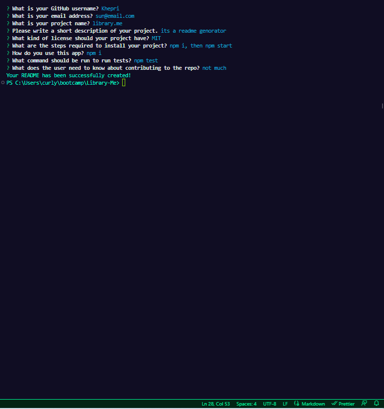

# README GenThis irerator
This is a command-line application that generates a README file for your project. The application uses Node.js and the Inquirer package to prompt the user for information about their project.

## Installation
To install the application, run the following command:
npm install

## Usage
To use the application, run the following command:

##  node index.js
The application will then prompt you for information about your project, such as your GitHub username, project name, and project description.

## License
This project is licensed under the MIT license.

## Contributing
Contributions to this project are welcome! To contribute, please fork the repository and submit a pull request.

## Tests
To run tests for this project, use the following command:
 npm test

## Contact
If you have any questions or concerns about this project, please contact me at Collazo.jakepr@gmail.com.

Thank you for using the Library-Me README Generator!